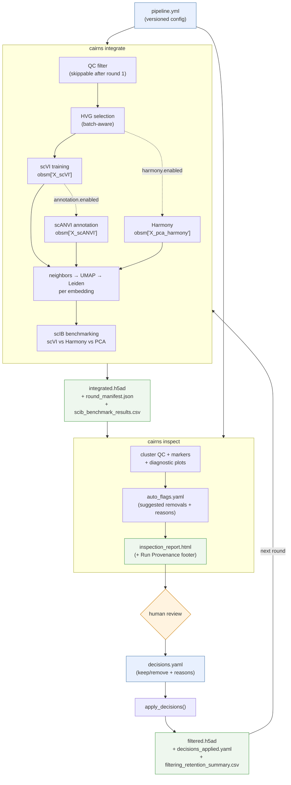

# scCairns


**Reproducible single-cell integration with a documented decision trail.** Integrate a
multi-batch dataset with [scVI/scANVI](https://scvi-tools.org/) (or Harmony/Scanorama),
inspect the result, decide which cells and clusters to drop, filter, and re-integrate —
repeating until the data is clean. Every round records its seed, code commit, and input
fingerprint, so the whole lineage is reproducible. Like a trail of cairns, each round
leaves a marker you can retrace.

```text
per round:     integrate → inspect → edit decisions → filter → re-integrate
                                   ↓  each round stamps a round_manifest
across rounds:   round 1 → round 2 → round 3 → …   (seed · commit · input hash · parent pointer)
                                   ↓
               cairns summarize → decisions ledger + lineage + integrity report
```

**Who it's for:** anyone doing quality-controlled single-cell integration who wants a
reproducible, reviewable loop rather than an ad-hoc notebook. The defaults are tuned
for mouse sympathetic-nervous-system data, but the engine is dataset-agnostic — see
[Adapting to your data](docs/adapting-to-your-data.md).

## New here? Start with the docs

| Guide | For |
|---|---|
| **[Getting started](docs/getting-started.md)** | Install, verify, and the input-data contract |
| **[Tutorial](docs/tutorial.md)** | A full runnable loop on synthetic data (no downloads) |
| **[Configuration reference](docs/configuration.md)** | Every config field, and *when to change it* |
| **[Integration methods](docs/integration-methods.md)** | Tune the scVI architecture, or swap in another method (Scanorama, etc.) |
| **[Decisions (`decisions.yaml`)](docs/decisions.md)** | The filtering syntax |
| **[Interpreting outputs](docs/interpreting-outputs.md)** | Is my integration good? When do I stop? |
| **[Adapting to your data](docs/adapting-to-your-data.md)** | Non-mouse / non-SNS datasets (and: should you fork?) |
| **[Troubleshooting](docs/troubleshooting.md)** | Common errors and fixes |
| **[Code Ocean](docs/codeocean.md)** | Running the capsule |

## Workflow



The filtered output of each round feeds the next round's integration. A human reviews
the report and authors the `decisions.yaml` — that's the one non-automated gate.

## Package layout

`scCairns` installs as the `sccairns` package with a single `cairns` command:

| Module / command | Role |
|---|---|
| `sccairns.integrate` — `cairns integrate` | QC, HVG selection, scVI training, optional scANVI annotation, UMAP/Leiden, benchmarking → `integrated.h5ad` |
| `sccairns.inspect` — `cairns inspect` | Inspection report, cluster QC, auto-flags, and decisions-based filtering |
| `sccairns.summarize` — `cairns summarize` | Cross-round summary: table, decisions ledger, Mermaid lineage, integrity report |
| `sccairns.record_filter` — `cairns record-filter` | Record provenance for a filter applied outside scCairns (Seurat, Loupe, a notebook), from an `.h5ad` pair or cell-ID lists |
| `sccairns.contamination` — `cairns flag-contamination` | Marker-based per-cell contamination flagging (used by inspection) |
| `sccairns.config` | Shared config defaults, validation, and provenance helpers |

> The package lives at `code/sccairns/` (not the repo root) because Code Ocean
> reproducible runs ship only the `code/` folder. `pyproject.toml` maps it back to the
> import name `sccairns` for local/PyPI installs, so `import sccairns` works everywhere.
> The `code/*.py` scripts are thin backward-compat shims (e.g. `python code/integrate_scvi.py`)
> so the Code Ocean capsule keeps working unchanged; new work should prefer the `cairns` CLI.

## Quick start

Install (details in [getting-started.md](docs/getting-started.md)):

```bash
mamba create -n sccairns -c conda-forge python=3.10 pip scikit-misc -y
mamba activate sccairns
python -m pip install -r requirements.txt   # pinned scientific stack
python -m pip install -e .                  # the sccairns package + `cairns` CLI
```

One full round, locally:

```bash
cp examples/pipeline_scvi.yml pipeline.yml      # then edit data.input_h5ad / output_dir

# 1. integrate
cairns integrate --config pipeline.yml

# 2. inspect (writes inspection_report.html + auto_flags.yaml)
cairns inspect --config pipeline.yml

# 3. review the report, rename auto_flags.yaml -> decisions.yaml, edit it, then filter:
cairns inspect --config pipeline.yml \
  --input rounds/round_01/integrated.h5ad \
  --decisions rounds/round_01/decisions.yaml \
  --output-dir rounds/round_02

# 4. re-integrate the filtered object for the next round
cairns integrate --config pipeline.yml \
  --input rounds/round_02/filtered.h5ad --output-dir rounds/round_02
```

Prefer a guided, runnable version? Follow the **[tutorial](docs/tutorial.md)** — it
generates a synthetic dataset and walks the whole loop with expected numbers.

## Outputs and provenance

Each round writes a cumulative record. Highlights:

| File | Description |
|---|---|
| `integrated.h5ad` | All genes; log-normalized `.X`; raw counts in the counts layer; embeddings, UMAPs, clusters |
| `inspection_report.html` | Self-contained report with a Run Provenance footer |
| `auto_flags.yaml` | Suggested removals — the starting point for your `decisions.yaml` |
| `filtered.h5ad` | The filtered object for the next round |
| `filtering_retention_summary.csv` | Pre/post counts by cluster, batch, and cluster × batch |
| `run_config_resolved.yml` | The fully merged config that actually ran |
| `round_manifest.json` | Seed, git commit, input fingerprint, parent-round pointer, package versions |

**Reproducibility.** `reproducibility.seed` (default 0) is applied via
`scvi.settings.seed` before any stochastic step, so scVI/scANVI training, the neighbor
graph, UMAP, and Leiden clustering are deterministic — which makes the Leiden
**cluster IDs** that `decisions.yaml` references stable across re-runs of the same
config. Set `seed: null` for an intentionally non-reproducible run. Every
`round_manifest.json` also identifies the pipeline that ran — its installed `version`,
plus the git revision and a `dirty` flag when running from a checkout — along with
a SHA-256 fingerprint of the input, and a `parent_round` pointer linking rounds into
an explicit lineage. Installed from a pinned release rather than a checkout, the version
is the identifier, so pin an exact tag in whatever builds your environment. `command_args.json` keeps an append-only history of every stage
invocation. Full field-by-field detail lives in the
[configuration reference](docs/configuration.md) and
[interpreting outputs](docs/interpreting-outputs.md).

If filtering happened in an external interactive tool, record the same provenance
without re-running Cairns filtering:

```bash
cairns record-filter \
  --input-h5ad rounds/round_01/integrated.h5ad \
  --output-h5ad rounds/round_02/filtered.h5ad \
  --output-dir rounds/round_02 \
  --embedding-key X_scVI_Xlarge_geneXcell_cell_nb \
  --filter-used "Removed non-neuronal clusters from interactive review" \
  --notes "Manual lasso/cluster filtering in interactive mode"
```

Either side can be a list of cell IDs instead of an `.h5ad` (`--input-cell-ids` /
`--output-cell-ids`), so a tool that can't write AnnData — Seurat, Loupe — can hand back
just the barcodes it kept. `--embedding-key` is optional, for a filter applied at ingest
before any embedding exists. See
[filtering outside scCairns](docs/decisions.md#filtering-outside-sccairns-seurat-loupe-a-notebook).

## Summarizing a completed set of rounds

After several rounds, combine every `round_manifest.json` into one view. Point at a
parent directory of `round_*` subdirectories:

```bash
cairns summarize --rounds-dir results/rounds --verify
```

…or pass an explicit, ordered list of round directories (useful when rounds are
archived under arbitrary names — e.g. Code Ocean overwrites `/results` each run, so
rounds are copied out to durable storage):

```bash
cairns summarize \
  --rounds data/260603_cmg_round1 data/260605_cmg_round3 \
  --output-dir results/summary --verify
```

| Output | Contents |
|---|---|
| `pipeline_summary.md` / `.html` | Round table + Mermaid lineage + integrity findings |
| `rounds_table.csv` | One row per round (input + final cells, clusters, seed, commit, filtered-on variant, scIB scores) |
| `decisions_ledger.csv` | Every keep/remove action across all rounds |
| `lineage.mmd` | Raw Mermaid lineage diagram |
| `pipeline_summary.json` | Full merged record + verification verdicts |

With `--rounds`, the supplied order is taken as the lineage when run-time paths no
longer resolve; `--verify` still hashes each parent's `integrated.h5ad` as it sits on
disk and compares it to the child's recorded input fingerprint. `--strict` exits
non-zero when a check fails, so the summary can gate CI. In discovery mode
(`--rounds-dir`), rounds are ordered by their recorded `parent_round` lineage.

## Environment

Local development uses a Python 3.10 conda/mamba environment and `requirements.txt`
(CPU-friendly `scvi-tools==1.3.3`). The [Docker image](docs/codeocean.md) pins the
same libraries with the CUDA extra for GPU/container parity. Run the checks with:

```bash
python -m compileall -q sccairns code tests
python -m pytest -q
```

## Notes

- V1 supports `integration.model_type: scvi`; scANVI is an annotation stage on top of
  the single-model scVI path (not combinable with sweeps).
- SNS marker defaults are part of the resolved config/template rather than implicit
  inspection logic, so they're visible and overridable.

## License

See [LICENSE](LICENSE) (Allen Institute).
